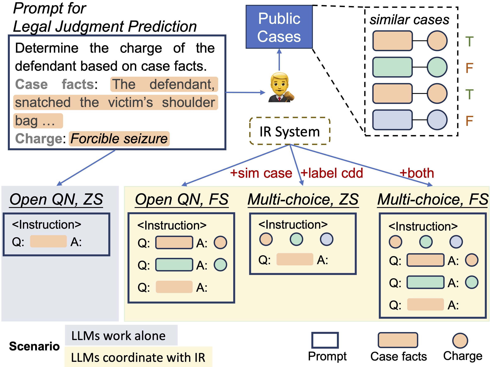

<h1 align="center">
⚖️
<br>
A Comprehensive Evaluation of LLMs on 
<br> Legal Judgment Prediction
</h1>

<div align="center">


</div>

<p align="center">
  <a href="https://srhthu.github.io/LM-CompEval-Legal/"><b>[🌐 Website]</b></a> •
  <a href="https://arxiv.org"><b>[📜 Paper]</b></a> •
  <a href="https://github.com/srhthu/LM-CompEval-Legal"><b>[🐱 GitHub]</b></a>
  <br>
  <a href="#-quick-start">Quick Start</a> •
  <a href="#%EF%B8%8F-citation">Citation</a>
</p>

<p align="center">
Repo for "<a href="https://arxiv.org/abs/" target="_blank">A Comprehensive Evaluation of Large Language Models on Legal Judgment Prediction</a>" <br> published at <b>EMNLP Findings 2023</b>
</p>

## 💡 Introduction
To comprehensively evaluate the law capacity of large language models, we propose baseline solutions and conduct evaluation on the task of *legal judgment prediction*.

**Motivation**  
Existing benchmarks, e.g., [lm_eval_harness](https://github.com/EleutherAI/lm-evaluation-harness), mainly adopt a **perplexity**-based approach to select the most possible options as the prediction for classification tasks. *However*, LMs typically interact with humans in the way of open-ended generation. It is critical to directly evaluate the generated contents by greedy decoding or sampling.

**Evaluation on LM Generated Contents**  
We propose an automatic evaluation pipeline to directly evaluate the generated contents for **classification** tasks. 
1. Given prompts with task instructions, LMs are expected to generate class labels. The generated contents may not strictly match standard label names.
2. Then, a parser is to map generated contents to labels, based on the text similarity scores.

**LM + Retrieval System**  

To address the performance with retrievad information of LMs in legal domain, additional information, e.g., label candidates and similar cases as demonstrations, are included into prompts. Considering the combination of the two additional information, there are four sub-settings of prompts: 
- (**free, zero shot**): No additional information. Only task instruction.
- (**free, few shot**): Task instruction + demonstrations
- (**multi, zero shot**): Task instruction + label candidates (options)
- (**multi, few shot**): Task instruction + label candidates + demonstrations

<p align="center">

<p>


## 🔥 Leaderboard

<table border="1" class="dataframe">
  <thead>
    <tr style="text-align: center;">
      <th>rank</th>
      <th>model</th>
      <th>score</th>
      <th>free-0shot</th>
      <th>free-1shot</th>
      <th>free-2shot</th>
      <th>free-3shot</th>
      <th>free-4shot</th>
      <th>multi-0shot</th>
      <th>multi-1shot</th>
      <th>multi-2shot</th>
      <th>multi-3shot</th>
      <th>multi-4shot</th>
    </tr>
  </thead>
  <tbody>
    <tr>
      <td>1</td>
      <td>gpt4</td>
      <td>63.05</td>
      <td>50.52</td>
      <td>62.72</td>
      <td>67.54</td>
      <td>68.61</td>
      <td>71.02</td>
      <td>62.31</td>
      <td>70.42</td>
      <td>71.81</td>
      <td>73.24</td>
      <td>74.00</td>
    </tr>
    <tr>
      <td>2</td>
      <td>chatgpt</td>
      <td>58.13</td>
      <td>43.14</td>
      <td>58.42</td>
      <td>61.86</td>
      <td>64.40</td>
      <td>66.16</td>
      <td>60.67</td>
      <td>63.51</td>
      <td>66.85</td>
      <td>69.59</td>
      <td>66.62</td>
    </tr>
    <tr>
      <td>3</td>
      <td>chatglm_6b</td>
      <td>47.74</td>
      <td>41.89</td>
      <td>50.30</td>
      <td>47.76</td>
      <td>48.59</td>
      <td>48.67</td>
      <td>53.74</td>
      <td>49.26</td>
      <td>47.56</td>
      <td>47.61</td>
      <td>45.32</td>
    </tr>
    <tr>
      <td>4</td>
      <td>bloomz_7b</td>
      <td>44.14</td>
      <td>46.90</td>
      <td>53.28</td>
      <td>51.06</td>
      <td>50.90</td>
      <td>49.26</td>
      <td>50.68</td>
      <td>29.25</td>
      <td>27.92</td>
      <td>25.27</td>
      <td>23.37</td>
    </tr>
    <tr>
      <td>5</td>
      <td>vicuna_13b</td>
      <td>39.83</td>
      <td>25.50</td>
      <td>48.85</td>
      <td>47.64</td>
      <td>49.49</td>
      <td>39.82</td>
      <td>44.70</td>
      <td>41.73</td>
      <td>41.48</td>
      <td>35.03</td>
      <td>21.61</td>
    </tr>
  </tbody>
</table>

Note:
- **Metric**: Macro-F1
- $score = (free\text{-}0shot + free\text{-}2shot + multi\text{-}0shot + multi\text{-}2shot)/4$
- OpenAI model names: *gpt-3.5-turbo-0301*, *gpt-4-0314*

## 🚀 Quick Start
### ⚙️ Install
```Bash
git clone https://github.com/srhthu/LM-CompEval-Legal.git

# Enter the repo
cd LM-CompEval-Legal

pip install -r requirements.txt

bash download_data.sh
# Download evaluation dataset to data_hub/ljp
# Download model generated results to runs/paper_version
```
The data is availabel at [Google Drive](https://drive.google.com/drive/folders/1UWi9F4vtBORsnCUqDDkyehdH4IyDfnME?usp=share_link)

### Evaluate Models

There are totally 10 `sub_tasks`: `{free,multi}-{0..4}`.

Evaluate a **Huggingface** model on all sub_tasks:
```Bash
CUDA_VISIBLE_DEVICES=0 python main.py \
--config ./config/default_hf.json \
--output_dir ./runs/test/<model_name> \
--model_type hf \
--model <path of model>
```

Evaluate a **OpenAI** model on all sub_tasks:
```Bash
CUDA_VISIBLE_DEVICES=0 python main.py \
--config ./config/default_openai.json \
--output_dir ./runs/test/<model_name> \
--model_type openai \
--model <path of model>
```

To evaluate some of the whole settings, add one more argument, e.g.,
```Bash
--sub_tasks 'free-0shot,free-2shot,multi-0shot,multi-2shot'
```

The huggingface paths of the evaluated models in the paper are
-  ChatGLM: `THUDM/chatglm-6b`
-  BLOOMZ: `bigscience/bloomz-7b1-mt`
-  Vicuna: `lmsys/vicuna-13b-delta-v1.1`

**Features**:
> - If the evaluation process is interupted, just run it again with the same parameters. The process saves model outputs immediately and will skip previous finished samples when resuming.  
> - Samples that trigger a GPU out-of-memory error will be skipped. You can change the configurations and run the process again. (See suggested GPU configurations below)

**Suggested GPU configurations**
- 7B model
  - 1 GPU with RAM around 24G (RTX 3090, A5000)
  - If total RAM >=**32G**, e.g., 2\*RTX3090 or 1\*V100(32G), add the `--speed` argument for faster inference.
- 13B model
  - 2 GPU with RAM >= 24G (e.g., 2\*V100)
  - If total RAM>=**64G**, e.g., 3\*RTX3090 or 2\*V100, add the `--speed` argument for faster inference
> When context is long, e.g., in multi-4shot setting, 1 GPU of 24G RAM may be insufficient for 7B model. You have to eigher increase the number of GPUs or decrease the demonstration length (default to 500) by modifying the *demo_max_len* parameter in `config/default_hf.json`

### Create Result table
After evaluating some models locally, the leaderboard can be generated in csv format:

```Bash
python scripts/get_result_table.py \
--exp_dir runs/paper_version \
--metric f1  \
--save_path resources/paper_version_f1.csv
```

## Citation

<!-- 
## Tests
Test the model
```Bash
# test decoder-only lm
CUDA_VISIBLE_DEVICES=0 python -m tests.model_generate --model gpt2
# test prefix-lm
CUDA_VISIBLE_DEVICES=0 python -m tests.model_generate --model THUDM/chatglm-6b
# test encoder-decoder lm
CUDA_VISIBLE_DEVICES=0 python -m tests.model_generate --model google/t5-v1_1-base 
google/t5-v1_1-base
```
Test the building of task data
```Bash
python -m tests.ljp_task
```

```Bash
CUDA_VISIBLE_DEVICES=3 python main.py \
--config ./config/default_hf.json \
--output_dir ./runs/baichuan_7b \
--model_type hf \
--model /storage/rhshui/ssd/llm/baichuan-7b
``` -->
